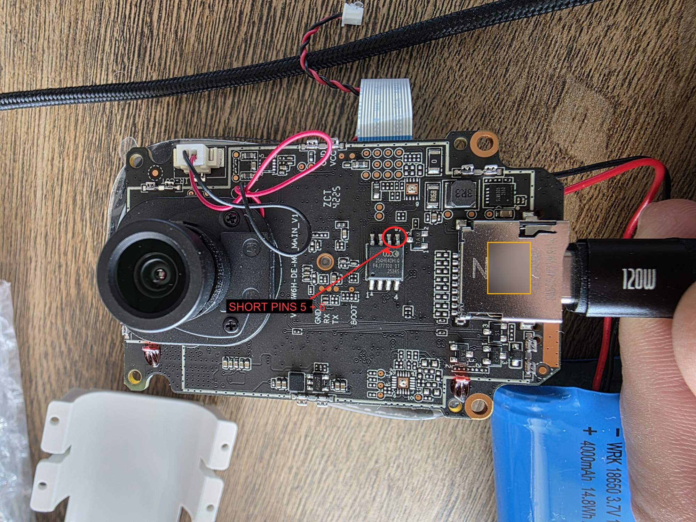

# Hardware Disassembly & BootROM / USB-DFU Entry

This is the **one-time hardware procedure** that puts a BW4 camera into USB update mode
(the SoC's USB BootROM) so a PC can write firmware to it over USB-DFU. You need it exactly
twice in a camera's life:

- for the **first stock → custom conversion**, before there is any working shim/SD flash path, and
- to **rescue a bricked unit** that won't boot at all.

For every routine update after that, you flash `mtd4` over SD/TFTP/serial and never open the
case again — see [FLASHING.md](FLASHING.md). Be honest with yourself: this step means taking
the camera apart, handling a Li-ion cell, and bridging two tiny flash pins during power-on.
It is not a casual step and it does require a steady hand.

---

> ## ⚠️ Safety — read before you start
> - **Power off and unplug** (USB-C out, battery unclipped) before you open anything.
> - **ESD:** ground yourself (wrist strap or touch bare metal) and work on a
>   **non-conductive surface**. The bare mainboard is static-sensitive.
> - **Li-ion care:** the 18650 cell (3.7 V / 4000 mAh) is a separate connector. Do **not**
>   puncture, crush, short, or bend it. Handle it gently and set it aside safely.
> - **Only short pins 5 + 6** of the flash chip. Do **not** let the tool touch neighbouring
>   pins or any power rail — the wrong pins can damage the board.

---

## What you need

- Small **Phillips screwdriver** (the enclosure/board screws are tiny).
- **Plastic pry tool / spatula** to peel the silicone cover and split the enclosure.
- **Fine tweezers or a thin jumper wire** to bridge the two flash pins.
- **USB-C cable** (any that carries power; a data cable is fine).
- A **Windows PC** with this repo's flasher tools (`tools/thingino-dfu`, `tools/dfu-util`).

---

## Disassembly (in order)

1. **Remove the 2 screws under the silicone cover.** Peel back the silicone weather cover to
   expose them, then unscrew both.
2. **Extract the camera module from the plastic enclosure.** Ease it out with the plastic pry
   tool; take your time so you don't stress the ribbon or wiring.
3. **Unscrew the board and the battery.** The **18650 Li-ion (3.7 V / 4000 mAh)** is on its
   own connector — unclip it gently and set it aside. Do not puncture or short it.
4. **Remove the ESD / metal shield** to fully expose the mainboard and the flash chip.
5. **Short the two flash pins during power-on** (next section) to force the SoC into USB
   BootROM mode.

The board silkscreen reads **`VP_BW6H-DE-M_MAIN_V1`**. The SoC is an Ingenic **T23N**; WiFi is
an **AIC8800**; the flash you are about to short is the **25QH64** SPI-NOR (body marked
`25QH64DHIQ`).

---

## Enter BootROM (short pins 5 + 6, then power on)

The target is the **25QH64 SPI-NOR flash** — an **8-pin SOIC** on the mainboard. You are going
to short **pin 5 (DI)** and **pin 6 (CLK)**: the **two right-most pins on the TOP row** of the
chip.

**Finding the pins** — the board silkscreens a small **"5"** next to the top-right pin, and
pin 6 sits immediately to its left. For orientation the corners are silked too: **"1"** =
bottom-left, **"4"** = bottom-right, **"5"** = top-right. So pins 5 and 6 are the top-right
pair.

*(The red circle marks pins 5 + 6. The QR code on the RF shield in this photo is intentionally
blurred for privacy — it is not part of the procedure.)*

**Technique:**

1. With the shield off and the board on a non-conductive surface, **bridge pins 5 + 6** with
   metal tweezers or a thin jumper — touching only those two pins.
2. **While holding the short**, apply USB-C power (click the battery in / plug the USB-C).
3. **Hold the short ~2 s**, then release.

Shorting the DI/CLK lines corrupts the BootROM's SPI read at power-on, so the SoC falls back
to its **USB BootROM**. The PC then enumerates a new device with **`VID_A108&PID_C309`**
(`a108:c309`). Once you see that, you're in — move to the flash.

---

## Flash (see FLASHING.md for the exact commands)

Once `a108:c309` enumerates, hand off to the PC-side flasher documented in
[FLASHING.md → *Last resort — full DFU restore*](FLASHING.md#last-resort--full-dfu-restore).
In short: `thingino-dfu` **bootstraps** the BootROM (`-b --wait --cpu t23zn`), then
**`dfu-util`** does the actual write/readback (`dfu-util -a flash -D/-U …`). Keep those exact
commands in FLASHING.md — don't re-derive them here.

Two things to know while doing it:

- **~60 s window.** U-Boot's DFU loader auto-boots after ~60 s (bootdelay 0), so the whole
  8 MiB transfer has to finish inside that window. If it times out, just re-trigger the short
  and go again.
- **`LIBUSB_ERROR_PIPE`** mid-write is intermittent and harmless — re-trigger the short,
  bootstrap again, and retry the transfer.

---

## Reassembly (reverse order)

Once the flash is verified (see FLASHING.md), put it back together in reverse:

1. **Reseat the ESD / metal shield.**
2. **Reconnect and screw down the battery**, then the board.
3. **Slide the module back into the plastic enclosure.**
4. **Refit the 2 screws** under the silicone cover.
5. **Press the silicone weather cover back over the screws** so the unit is sealed again.

---

## What a full DFU write means for your camera (reversibility)

A routine deploy writes **only `mtd4`** and is fully revert-safe. A full USB-DFU is the
**whole-chip** path, so it also **resets `mtd5` NVS to factory** — the WiFi credentials are
wiped. On first boot after a full DFU the camera therefore:

- **re-provisions WiFi from the SD `wifi.ini`** (drop your SSID/password on the card — see
  [FEATURES.md → *wifi_sd.so — SD-card WiFi onboarding*](FEATURES.md#wifi_sdso--sd-card-wifi-onboarding)),
  and
- comes up on its **factory default password** until you read/set your unit's credentials
  ([ARCHITECTURE.md](ARCHITECTURE.md) → *Device password*).

For everything about the software flash, backups, and the golden "only `mtd4`" rule, see
[FLASHING.md](FLASHING.md).

---

## When you need this

- **First conversion:** stock → custom, one time, to bootstrap the very first flash.
- **Rescue:** a unit that won't boot at all and can't be recovered over SD/TFTP/serial.

If the camera boots and reaches WiFi, you do **not** need this procedure — flash `mtd4` the
normal way ([FLASHING.md](FLASHING.md)) and leave the case shut.
